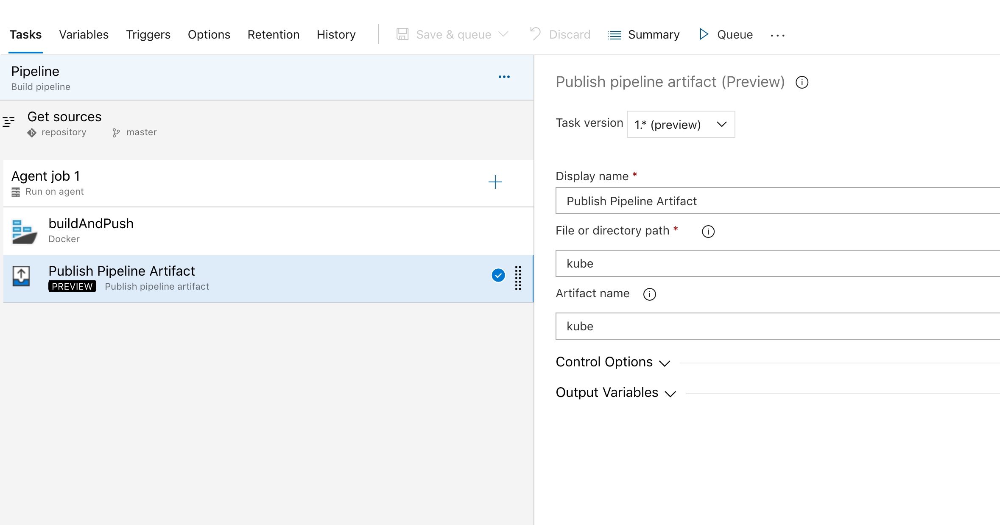
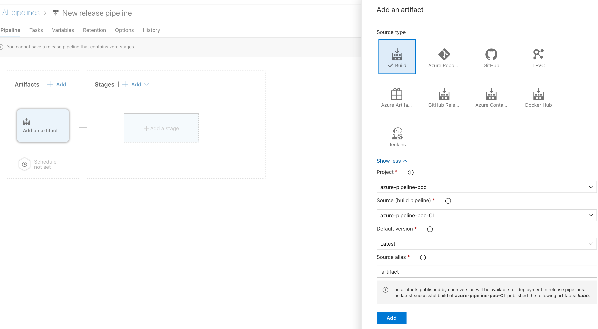
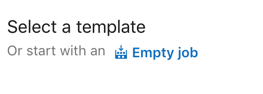
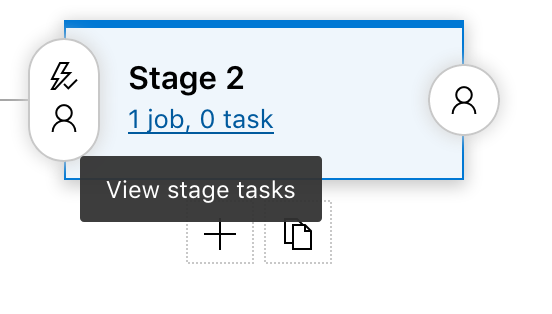
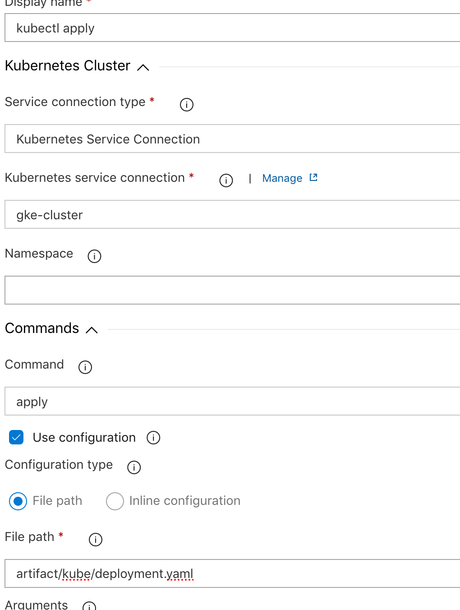
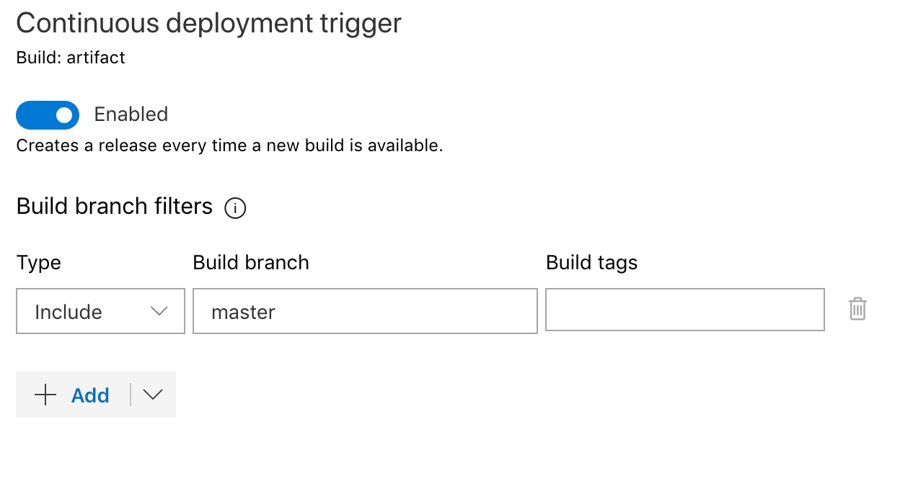

# How to deploy to GKE using AzureDevOps
A brief guide to deploying to GKE.

## Explination of files in this repository
* Dockerfile
    * [Instructions](https://docs.docker.com/engine/reference/builder/) to build a Docker image
* kube
    * Kubernetes deployment files
        * if you are using [helm](helm.sh), the same steps apply, simply change step 3 to use a helm install/update
* make_kube_service_accounts.sh
    * Creates a service-account named *admin-user*, then outputs the account information (including secret token)

#### Pre-requirements / Assumptions:
* Local machine's current kubectl context is pointing to cluster which will be deployed to
* Local machine can run bash scripts
* Local machine has kubectl, grep, jq
* Google Container Registry is being used for storing container images *(Otherwise auth for pulling images from cluster is properly configured)*
* Existing AzureDevOps build (builds and pushes to above registry, [sample available here](img/0.1build.png))

## Step 0
0. Run make_kube_service_accounts.sh
1. Add new Service Connection in AzureDevOps (Script's output provides more details)

## Step 1
0. Add new build step to your existing AzureDevOps build that creates an artifact from your kubernetes deployment files

## Step 2
0. Create a new pipeline release (Pipelines -> Releases)
1. Add a new artifact (Choose the artifact from step 1)

2. Add a new stage, using the 'Empty Job' template

3. Add a new task

## Step 3
0. Select your cluster from step 0, then enter the path of your deployment file into the 'File Path' field

## Step 4
0. In your artifact step, add an additional trigger so that once a new artifact is ready, it will automatically release

