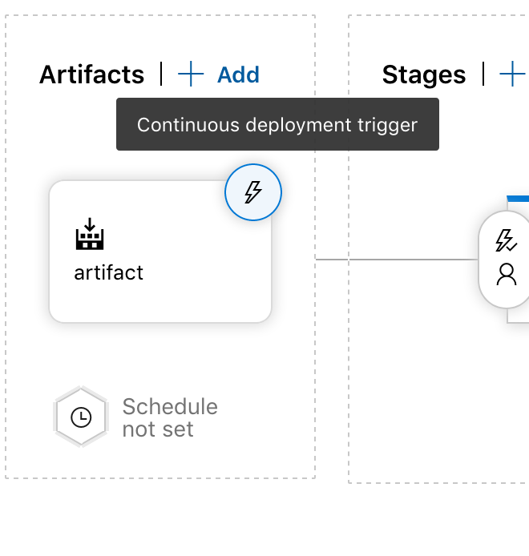

# How to deploy to GKE using AzureDevOps
A brief guide to deploying to GKE.

#### Pre-requirements / Assumptions:
Local machine's current kubectl context is pointing to cluster which will be deployed to
Local machine can run bash scripts
Local machine has kubectl, grep, jq
AzureDevOps build is completed (Build and pushes to GKE repository)
Google Container Registry is being used for deployment

## Step 0
0. Run make_kube_service_accounts.sh
1. Add new Service Connection in AzureDevOps (Script's output provides more details)

## Step 1
0. Add new build step that creates an artifact from your kubernetes deployment files

## Step 2
0. Create a new pipeline release (Pipelines -> Releases)
1. Add a new artifact (Choose the artifact from step 1)

2. Add a new stage, using the 'Empty Job' template

3. Add a new task

## Step 3
0. Select your cluster from step 0, then enter the path of your deployment file

## Step 4
0. In your artifact step, add an additional trigger so that once a new artifact is ready, it will automatically release

